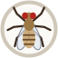

# A fly walks a route (NeuroMechFly v2 / FlyGym 2.1)

A learning project: a physical model of the fruit fly's body (NeuroMechFly v2, the
[FlyGym](https://neuromechfly.org) library) walks a route from `route.yaml` across a flat arena.
The output is a video, the trajectory as CSV, and a plot of it. The fly can also walk towards what it
sees and escape from a looming pillar; in the latter case the decision is made by a model of its whole
brain, built from the connectome (138,639 neurons, see [below](#a-brain-from-the-connectome-the-fly-escapes-a-looming-pillar)).
The same brain also runs in the browser: **[the fly terrarium](https://s31fdev.github.io/fly-terrarium/)**
(see [below](#terrarium-in-the-browser-web)).

## Running

You need [uv](https://docs.astral.sh/uv/): it downloads Python 3.12 by itself and installs the
dependencies into the project's `.venv`. Setup (once), from the project folder:

```powershell
# if uv is not installed yet; open a new terminal after installing it
powershell -ExecutionPolicy ByPass -c "irm https://astral.sh/uv/install.ps1 | iex"
uv venv --python 3.12
uv pip install -r requirements.txt
```

On Linux and macOS, install uv with `curl -LsSf https://astral.sh/uv/install.sh | sh`; the rest is the same.
If the environment was created earlier, repeat the last line: the connectome brain added `pyarrow`.

The example route:

```bash
uv run run_route.py
```

Simulating the route (11.3 s of model time) takes about 2.5 minutes: on an i7-9700F one second of
model time takes about 12 seconds.

## Output (`./output`)

| File | Contents |
|---|---|
| `route.mp4` | video from a camera that follows the fly from above (0.5× speed, 25 fps, 640×480) |
| `trajectory.csv` | `time_s, x_mm, y_mm, heading_deg, step, action`, every 10 ms |
| `trajectory.png` | the trajectory from above, colour = route step, arrows = the fly's heading once per second |
| `run.log` | progress of the simulation and a summary per step: how far the fly walked and how many degrees it turned |

The axes are the same everywhere: x to the right, y up. `heading_deg` = 0° means the fly faces +x,
a positive angle = counterclockwise. Turning left increases the angle.

## Changing the route

`route.yaml` is a list of steps, executed top to bottom:

```yaml
- {action: forward, duration_s: 3.5, strength: 1.0}
- {action: left,    duration_s: 3.0, strength: 0.1}   # gentle turn
- {action: right,   duration_s: 0.3, strength: 0.7}   # sharp turn
- {action: stop,    duration_s: 2.0}                  # strength can be omitted
```

- `forward`: `strength` = step amplitude (1.0 = normal walking, about 14 mm/s).
- `left` / `right`: `strength` = sharpness of the turn. The outer side steps with amplitude 1.0,
  the inner side with amplitude `1 − 2·strength`: 0 = straight, 0.5 = the inner legs stand still,
  1.0 = the inner legs step backwards (turning almost on the spot).
- `stop`: both sides 0, the fly stops.

Another route file: `uv run run_route.py my_route.yaml`.

Turning speed in our runs (approximate, depends on the previous step):

| strength | turning speed |
|---|---|
| 0.1 | ~30°/s, a gentle arc |
| 0.3 | ~90–100°/s |
| 0.7 | ~220°/s |
| 0.9 | ~310°/s, almost on the spot |

For debugging, a short 2–3 second route is handy.

## A live fly in a window

`run_live.py` shows the fly in a MuJoCo window in real time, and you can steer it with the keyboard.

```powershell
uv run run_live.py          # you steer the fly with the arrow keys
uv run run_live.py vision   # the fly walks by itself to a dark pillar it sees with its eyes
uv run run_live.py escape   # you can throw a pillar at the fly, and its connectome brain decides how to escape
```

The `escape` mode is controlled like `vision`, but the fly stands still until frightened (see the section
[on the connectome brain](#a-brain-from-the-connectome-the-fly-escapes-a-looming-pillar)).

| Key / mouse | Normal mode | `vision` mode |
|---|---|---|
| ↑ | walk | pillar away from the camera |
| ↓ | stop | pillar towards the camera |
| ← / → | turn; pressing again makes it sharper (0.3 → 0.5 → … → 1.0) | pillar left / right on the screen |
| Ctrl + right button, drag | push the selected fly | drag the pillar across the floor |

In `vision` mode one press of an arrow moves the pillar by 3 mm. The arrows work relative to the
camera, so if you rotate the view with the mouse, "up" stays "away from you". The fly is driven by the
same "brain" as in `run_vision.py` (see below). The **bottom right corner** of the window shows what the
fly sees: both eyes, 721 ommatidia each. The top left corner shows how much "dark" each eye sees,
what the brain decided and how far the pillar is. Checked: the fly reaches the pillar's starting position
in ~1.7 s, and after the pillar is moved it turns by itself and stops again 3–4 mm from its centre.

You can **drag the pillar with the mouse**: hold Ctrl and drag with the right button. The pillar is
selected from the start. If you double-clicked something else, such as the fly, double-click the pillar first.
By default MuJoCo drags an object in a vertical plane and would lift the pillar into the air, so
`run_live.py` turns mouse movement up/down into "away from you / towards you" along the floor. This was
checked by calling the same MuJoCo functions the window calls while dragging (`mjv_initPerturb` /
`mjv_movePerturb`). A real mouse could not be tested automatically: Windows does not let a background
script bring a window to the front.

Protection against physics failures:
- **Rotating bodies with the mouse (Ctrl + left button) is disabled.** Such rotation breaks the physics of
  this tiny model: in tests, rotating the fly by 30–180° gave NaN even with the precise settings of `run_route.py`.
- **If the physics does blow up**, MuJoCo resets the model into a strange pose. Then `run_live.py`
  puts the fly back by itself and says so in the console. Checked on two deliberately caused failures in a row.

| Mouse | Action |
|---|---|
| left button + drag | rotate the camera (it follows the fly) |
| right button + drag / wheel | move / zoom the camera |
| double-click on the fly, then Ctrl + right button | push the fly |

The other keys are built into MuJoCo itself. For example, letters toggle what is shown
(wireframe, collision shapes), Tab / Shift+Tab open the settings panels.
If the picture looks strange, just restart the window.

To keep up with real time, the physics is coarser than in `run_route.py`.
The settings are constants at the top of `run_live.py`:

| | `run_route.py` | `run_live.py` |
|---|---|---|
| physics time step | 0.1 ms | 0.25 ms |
| controller rate | 10,000 Hz | 500 Hz |
| MuJoCo noslip iterations | 5 | 2 |
| speed on an i7-9700F | ~12× slower than real time | **~0.93× real time** walking, ~0.85× standing; ~0.8× in `vision` mode |

The gait stays almost the same: 12.9 mm vs 13.1 mm in 1 s of walking, a turn at 0.3 for 1 s
gives +105° vs +111°. It cannot be coarser: at a 0.5 ms physics step the fly starts to hop,
and at a 250 Hz controller the turns get twice as weak. The current speed is shown in the top left corner
of the window: below 1.0 the fly moves in slight slow motion. The simulation never runs faster than
real time; it waits out the spare time.

## The fly walks to what it sees (vision)

```bash
uv run run_vision.py          # default pillar: (-10, 25) mm, behind to the left
uv run run_vision.py 20 -15   # your own pillar: x y in mm
```

The fly starts at (0, 0) facing +x; a dark pillar (radius 1.5 mm, height 10 mm) stands in the arena.
Real flies also turn towards dark vertical stripes (stripe fixation). Output:
- `output/vision.mp4`: the arena from above, below it what the fly sees (left eye | right eye);
- `output/vision.png`: the fly's path and the pillar;
- `output/vision.log`: what the eyes see and what the "brain" decides every 0.5 s.

How it works:

1. **Eyes.** `fly.add_vision()` puts two cameras with a 157° field of view each into the eyes.
   20 times a second FlyGym renders them and averages the image over **721 ommatidia per eye**
   (`sim.get_ommatidia_readouts`). Reading both eyes takes ~5 ms.
2. **What counts as an object.** Above the horizon the background is bright sky (brightness 1.0), below it
   a dark floor. So the "brain" only looks at the ommatidia above the horizon (eye image row < 220):
   anything dark there is an object. In an empty arena the sum of "darkness" there is ≈ 0.01.
3. **The "brain"** (the `brain` function):
   - almost nothing is visible (darkness sum < 0.3, e.g. the pillar is in the blind zone behind) —
     turn on the spot to look around;
   - a lot of darkness (> 100, the pillar blocks the view, ~5 mm to its centre) — stop, arrived;
   - otherwise turn towards the eye that sees the dark spot, the more sharply the further the spot is
     from straight ahead. A pillar straight ahead looks the same to both eyes, and the turn signal is 0.
4. The decision becomes the same `[left, right]` signal as in the route and goes to the walking controller.

Checked:

| Pillar | Where relative to the fly | Reached in | Stopped from the pillar's centre |
|---|---|---|---|
| (−10, 25) | behind to the left | 2.1 s | 3.5 mm |
| (20, −15) | ahead to the right | 1.7 s | 4.0 mm |
| (−25, −5) | in the blind zone behind | 2.6 s* (0.3 s looking around) | 3.5 mm |
| (30, 0) | straight ahead | 1.9 s* | 4.3 mm |

\* runs with the fast physics settings of the live mode. In no case did the fly wobble:
0 changes of turning direction.

There used to be a fly that walks towards a smell here (`run_odor.py`, the `odor` mode of the live window).
It is switched off but kept in the git branch `odor`: `git switch odor`.

## A brain from the connectome: the fly escapes a looming pillar

Here the decision is made not by a hand-written function but by a model of the fly's whole brain,
built from the connectome. A pillar flies at the standing fly; the eyes see it grow; the brain
answers through its descending neurons, and the fly turns and runs away.

```bash
uv run run_escape.py                 # the pillar comes from ahead to the left (60°)
uv run run_escape.py -60             # ahead to the right; 0 = straight ahead, 180 = behind
uv run run_escape.py 60 --shuffled   # control: the same fly, random wiring
uv run run_escape.py 60 --mcns       # the male brain instead of FlyWire (see below)
uv run brain.py                      # check the model against published results
```

In the live window: `uv run run_live.py escape`. The fly stands still, and you throw a pillar at it with the
arrow keys or the mouse (Ctrl + right button), as in `vision` mode. The top left corner shows numbers: the
input into the detector neurons, the giant fibres, DNa, MDN and the resulting signal to the legs. The top
right corner shows a **picture of the brain**: which of its neurons are firing right now (see below).
`uv run run_live.py escape mcns` does the same with the male brain.

The first run downloads the connectome (about 130 MB, from the GitHub of the model's authors and FlyWire)
and turns it into `data/connectome_783.npz` (115 MB). This takes about a minute; after that loading
takes a few seconds. The male brain downloads about 1.1 GB on its first run and becomes
`data/connectome_mcns.npz` (232 MB), also in about a minute; the downloaded files are deleted afterwards.
The `data/` folder is not in git. If a connectome was built before neuron positions were stored in it,
the first run downloads only the neuron table (31 MB for FlyWire, 14 MB for the male) and adds the
positions without touching the connections.

The results of `run_escape.py` go to `./output`, named by direction (`escape_60.*`, `escape_-60.*`, …):
- `escape_60.mp4`: the arena from above, below it what the fly sees, at the bottom the picture of the brain;
- `escape_60.png`: left, the paths of the fly and the pillar; right, the input into the brain and the answer of the descending neurons;
- `escape_60.log`: the same as numbers every 50 ms.

### The picture of the brain

Each neuron is a dot where its cell body lies (this is also how [Swat](https://github.com/hrook1/Swat) draws them).
Front view, the fly's left side on the left. The dots themselves form a silhouette: the big brain, the optic
lobes on the sides, and for the male the nerve cord (VNC) below. A neuron that fires flashes and fades
within about 0.3 s. Blue dots are the input (LC4, LPLC2, LC16), red squares are the neurons we read
(GF, DNa, MDN, plus TTMn for the male): bright when firing, dim at rest. All other flashes are yellow.
When the pillar comes from the left, you can see the blue detectors of the left eye light up, thousands
of yellow flashes spread through the brain, and the red squares light up.

The cell body position is known for 138,625 of the 138,639 FlyWire neurons (it is not recorded for the
rest) and for 141,000 of the 165,122 male neurons: sensory neurons have their cell bodies outside the
nervous system, which the connectome does not contain. Such neurons are simulated but not drawn. The
picture has no connections: there are 15–25 million of them, it would be a solid mess. The picture takes
2–3 ms to draw and does not change the speed of the window.

### What this brain is

The "leaky integrate-and-fire" model of Shiu et al. (2024, Nature), built on the FlyWire v783 connectome:
**138,639 neurons and 15.1 million connections (54.5 million synapses)**. Each neuron is a simple leaky
"piggy bank" of voltage: at −45 mV it fires a spike and resets. Each synapse excites or inhibits its
neighbour depending on the neurotransmitter. The weight of a connection is proportional to its number of
synapses. All constants are taken from the authors' [`model.py`](https://github.com/philshiu/Drosophila_brain_model).

The authors run the model in Brian2. On this machine Brian2 takes about 40 s per second of model time
(numpy mode, including building the network), so `brain.py` rewrites the same equations in numba
(which comes with FlyGym). That gives about 0.7 s per second of model time on 8 cores while the brain is
active. When there is no input and all neurons have fallen silent, no steps are computed at all, and the
remaining potentials decay by the exact formula.

**Checked** (`python brain.py`): we repeated the authors' example for which they published the Brian2
result. 21 sugar receptors of the right side were stimulated at 200 Hz, 30 runs of 1 s, connectome v630.

| | Brian2 (the authors) | `brain.py` |
|---|---|---|
| neurons that spiked | 448 | 449 |
| correlation of the rates of all neurons | | 0.9998 |
| MN9 (proboscis motor neuron: the fly starts to feed) | 93.3 Hz | 95.0 Hz |

The check revealed a detail that is not in the model's description. In Brian2, input that reaches a
neuron during its refractory period (2.2 ms after a spike) is **lost**. If such input is accumulated
instead, the rates of the neurons downstream of the sugar receptors come out a third higher (MN9 121 Hz
instead of 93). Checked on a network of 22 neurons (21 → 1): Brian2 gives 159 Hz, `brain.py` 160 Hz.

### How the loop works

Every 50 ms, in step with reading the eyes:

1. **Eyes.** As in `run_vision.py`, the "darkness" of the ommatidia above the horizon is taken. For each eye
   we compute how fast the dark spot grew over the last 0.1 s (ommatidia per second).
   A 0.1 s window is one leg stride, so the head bobbing of a walking fly cancels out in it.
2. **Input into the brain.** Growth faster than 50 ommatidia/s becomes Poisson input, like the optogenetics
   in the paper: 0.5 Hz per ommatidium/s above the threshold, at most 150 Hz. The input goes into the
   looming-detector neurons of the same eye: LC4, LPLC2 and LC16, 239 on the left and 226 on the right.
3. **The brain** runs for 50 ms, all 138,639 neurons.
4. **Output.** The spikes of descending neurons (they run from the brain to the legs) are read:
   - the giant fibres DNp01 (escape neurons) → how fast to run;
   - DNa01 + DNa02, right minus left → which way to turn;
   - MDN ("moonwalker") → walk backwards.
5. **Legs.** These make up the same `[left, right]` signal for `HybridTurningController`.
   Running continues for about 0.6 s after the fibres fall silent, turning and walking backwards for
   about 0.2 s. So the fly first turns and then runs.

| Decided by the connectome | Chosen by hand |
|---|---|
| whether the escape neurons fire; which DNa light up, left or right; whether walking backwards switches on | how spot growth becomes an input rate; which neurons count as input and output; how rates become the signal to the legs (constants at the top of `run_escape.py`) |

### What came out

The pillar (radius 1.5 mm) flies at 60 mm/s from 30 mm away and stops 6 mm from where the fly
stood. The physics is precise, as in `run_route.py`, 3 s of model time.

| Where the pillar comes from | What the brain answered | What the fly did |
|---|---|---|
| ahead to the left, 60° | giant fibres; DNa on the right | turned **right** by 51°, moved 4.8 mm away |
| ahead to the right, −60° | giant fibres; DNa on the left; a little MDN | turned **left** by 62°, moved 3.9 mm away |
| straight ahead, 0° | fibres, then DNa on the left and MDN | about 3 mm forward, then left by 93°, moved 4.5 mm away |
| behind, 180° | nothing: the pillar is in the eyes' blind zone | stands still |
| ahead to the left, **shuffled wiring** | nothing | stands still |

"Moved away" is how much further from the point where the pillar stopped the fly ended up. A run takes
about 45 s, almost all of it physics: the brain works only for the half second while the pillar flies.
The result repeats to the degree from run to run and matched Linux while the project ran
in Docker. `uv run brain.py` takes 17 s.
In all cases the fly turns **away from** the threat. Nowhere in the code does it say "turn away from it":
this follows from which DNa get excited through the wiring. With the threat straight ahead, chance decides
the direction. When it starts walking the fly drifts about 10° to the left (see limitations), the pillar
ends up in the right eye, and the brain turns the fly to the left.

**Control** (`--shuffled`). Each neuron keeps its synapses, their number and sign, but they lead
to random neurons. The input is the same (up to 150 Hz), yet the giant fibres, DNa and MDN do not fire
a single spike.
The behaviour rests on the wiring itself, not on the number of neurons and synapses.

In the live window this was checked with a script that "pressed" the arrows the same way the keyboard
handler does. The pillar was thrown from the left, the fibres fired, the fly turned right by 86° and ran
away (the distance to the pillar grew from 2.6 to 8.7 mm). At rest the window runs at about 0.78×
real time; during the escape it drops to 0.5× for about a second.

### A second connectome: the male brain (male CNS)

`--mcns` takes the [male CNS v1.0](https://male-cns.janelia.org/) connectome (Janelia, Berg et al. 2025,
CC-BY license). This is a different fly, and not only the brain: it includes the ventral nerve cord (VNC),
where the neurons of the legs and wings sit. **165,122 proofread neurons, 25.6 million connections, 124 million synapses.**
All the neurons we need are there under the same names: LC4, LPLC2, LC16, DNp01, DNa01, DNa02, MDN.
The model is the same, the code is the same. Three things differ:

- **The sign of a synapse.** Shiu et al. treat GABA and glutamate as inhibitory and everything else as
  excitatory (this rule was reconstructed from their data). FlyWire has no histamine, but in the male CNS
  about 6,000 neurons use it. In flies histamine opens chloride channels, so it is inhibitory too.
  If a neuron's consensus neurotransmitter is "unclear" (3,400 neurons), its own prediction is used.
- **The weight of a synapse.** On the same neurons the male CNS finds **1.8 times as many synapses**
  as FlyWire. This is the median over the 4,669 cell types present in both connectomes, for inputs (1.78)
  and outputs (1.81) alike. Since the difference is the same across the whole brain, it most likely comes
  from how the synapses were detected rather than from the flies themselves. The 0.275 mV weight was fitted
  to FlyWire, so a male CNS synapse weighs 0.275 / 1.8. Without this the brain is overexcited: 10–20
  thousand neurons fire at 20 to 150 Hz for any input, and the side of the turn gets lost.
- **A "jump" output.** The VNC has TTMn, the motor neuron of the jump muscle, to which the giant fibre
  passes the command to take off. It is written to the log and the plot (dotted). It does not move the legs:
  our model cannot jump.

The same experiment on the male brain:

| Where the pillar comes from | FlyWire (female, brain) | male CNS (male, brain and VNC) |
|---|---|---|
| ahead to the left, 60° | right by 51°, moved 4.8 mm away | right by 29°, moved 5.3 mm away |
| ahead to the right, −60° | left by 62°, moved 3.9 mm away | left by 85°, moved 5.4 mm away |
| straight ahead, 0° | left by 93°, moved 4.5 mm away | left by 60°, moved 2.5 mm away |
| behind, 180° | stands still | stands still |
| 60°, shuffled wiring | stands still | stands still |

**The main result repeated: the fly of another individual turns away from the threat**, because DNa light
up on the side opposite the threat. With shuffled wiring all outputs stay silent, TTMn included.
The male's giant fibres fire earlier and more strongly (about 100 Hz vs 40 at 20 Hz of input),
so the fly starts running before it has turned, and the turn comes out smaller.
**TTMn fires in all three cases** (40–100 Hz) while the pillar flies: in the model the command
"jump" goes from the eyes through the giant fibre to the motor neuron in the VNC.

A peculiarity of the male brain: after a fright a **self-sustaining loop** of about 50 neurons remains,
the descending DNg33 and ascending VNC neurons (AN09A005, AN27X013, IN09A005). They excite each other
in a circle, brain → VNC → brain, at 100–160 Hz. The Shiu model has no neuron fatigue, so nothing
can put the loop out. FlyWire cannot have it: it has no VNC. Our outputs are not part of it,
so it does not affect behaviour, but the brain is no longer silent and has to be computed all the time. The
live window runs at about 0.45× real time after the first fright instead of 0.78×.

A `run_escape.py --mcns` run takes about 50 s, a little longer than with FlyWire.
The live window was checked too: the pillar was thrown from the left,
the fly turned right by 47° and moved from 2.5 to 6.5 mm away.

### Honestly, what this means

- LC4 and LPLC2 → giant fibre is a known direct pathway, so its firing is expected.
  More interesting is that the model itself chooses the side of the turn (DNa) and walking backwards (MDN).
- The same behaviour can be written as a two-line rule: "turn away from the eye in which the spot grows".
  A similar project, [FLY-lab](https://github.com/Recluse/FLY-lab), compared the connectome with such a rule
  and found no difference. The value here is elsewhere: nobody wrote the rule, it came out of the wiring,
  shuffled wiring does not produce it, and it repeats on the connectome of another fly (male CNS).
- A real fly jumps and flies away from a threat: the giant fibre triggers the jump. Our model can only
  walk, so here the fibre means "run".
- The right and left halves of the brain answer differently. A threat from the right switches on MDN
  (walking backwards) noticeably more strongly than one from the left; that is how the connectome is wired.
- The eyes are connected to the brain not through the retina but directly to the detector neurons. The
  pathway from the photoreceptors does not work in this model. If all photoreceptors of one eye are
  stimulated (R1–6, R7, R8, 20 Hz), not a single spike reaches the descending neurons. So the "spot growth"
  is computed in Python and fed directly into LC4/LPLC2/LC16.
- The spot growth sensor is fooled by an object that slides into the field of view from the side instead
  of approaching. For example, if you drag the pillar quickly around the fly, it may get frightened.
- The time resolution is coarse: 1 spike in 50 ms is 20 Hz, so the rates in the log are multiples of 20.

Model: Shiu P.K. et al. *A Drosophila computational brain model reveals sensorimotor processing*,
Nature (2024). FlyWire connectome: Dorkenwald S. et al., Nature (2024). Cell types:
Schlegel P. et al., Nature (2024). The male brain: Berg S. et al., *Sexual dimorphism in the complete
connectome of the Drosophila male central nervous system*, bioRxiv (2025). Cite them if you publish
results.

## Terrarium in the browser (`web/`)

**Live: https://s31fdev.github.io/fly-terrarium/**

A fly in a Petri dish on a web page. Its decisions are made by the same brain model as in `brain.py`,
only rewritten in JavaScript and run in a background thread of the page. A switch picks the fly:
the female (FlyWire v783, brain only) or the male (male CNS, brain and nerve cord). Tools:

| Tool | Which neurons get input | What we read | What the fly does |
|---|---|---|---|
| Sugar | sugar taste neurons: the 29 from Shiu's paper in the female, LB3b and LB3c in the male | MN9, the proboscis motor neuron | stops and feeds, the drop shrinks |
| Bitter | bitter taste neurons LB1a–d | MN9 | does not feed, even standing on sugar |
| Puff | antennal mechanoreceptors JO-CE and JO-F, the closer the stronger (up to 200 Hz) | aDN1/aDN2 | cleans its antennae |
| Shadow from above | LC4, LPLC2, LC16 of the eye that sees the shadow | DNp01, DNa01/02, MDN, TTMn in the male | jumps, turns away, backs up |

Running it (prepare the data once, then open the page):

```bash
uv run export_web.py
uv run python -m http.server 8123 -d web
```

The page: http://localhost:8123. `export_web.py` writes the compressed connectome (30 and 48 MB), the
neuron map and the neuron groups for the tools to `web/data/783/` and `web/data/mcns/` (about a minute).
The page loads the connectome of the chosen fly.

The site is static: the server only serves files, the browser does all the computing. So it lives on
GitHub Pages, in the `gh-pages` branch of this repository. To update it after changes in `web/` or a new
data export: `bash publish_web.sh`. The script replaces the branch with a single new commit, so that the
77 MB of data do not pile up in the history. It needs a logged-in `gh`.
FlyWire data are licensed CC BY-NC 4.0, so the site is non-commercial only; the sources and licenses
are listed at the bottom of the page and in `web/SITE_README.md` (which becomes the README of the site branch).

`node web/check.mjs` checks the JavaScript model against `brain.py` in the sugar experiment, for both
flies: correlation of rates 0.9996 (FlyWire) and 0.9998 (male CNS), MN9 agrees within 2 Hz.

The model is the same, but computed differently. `brain.py` updates all neurons every 0.1 ms.
In the browser a neuron is updated only when a spike reaches it: its state is carried forward by the
exact formula, and the step at which it will cross the threshold, if it will, is computed right away.
The result is the same (see the check above) with 8–12 times less work. A silent brain costs nothing.
Sugar runs 7 times faster than real time; a strong shadow on both eyes at once runs at 0.7× real time
for the female and 0.3× for the male (i7-9700F, Node 24, one thread). If the brain cannot keep up,
the page slows the whole world down and says by how much.

What is made up, the page lists below the dish: the stroll while the brain is silent; the walls; the
strength of the stimuli; the eye as a formula of shadow growth; turning rates into movements; and for the
female the rule "a giant fibre spike = a jump". In the male the jump is triggered by the motor neuron TTMn
of its nerve cord, the command goes from the eyes to the muscle through the wiring. The "shuffle the wiring"
checkbox is the same control as `--shuffled`. With it the fly neither feeds, nor grooms, nor escapes.

The female and the male answer the same stimuli differently:

- **Antennal grooming.** You have to puff almost right at the female: aDN1/aDN2 respond from 150 Hz of
  input, and only to the left antenna. The right one does not produce a single output spike at any rate
  up to 220 Hz. The male grooms from 50 Hz and from both antennae, but the right one also switches on MN9
  (proboscis, 24 Hz).
- **Sugar.** In the male only the left MN9 answers (44 Hz), the right one stays silent. In the female both do (62 and 86 Hz).
- **The male brain is bistable.** A puff right at the fly (200 Hz on both antennae) throws about 5,600
  neurons into a wave that never dies out: Kenyon cells of the mushroom bodies, dopaminergic PAM neurons,
  the central complex (EPG, Delta7, PEN), about 400 thousand spikes per second. At 150 Hz this does not
  happen yet. The Python model behaves the same way. The model has no neuron fatigue, so the wave does not
  die out by itself, and the browser computes the brain 10–25 times slower than real time. In that case
  the page shows a "Calm the brain" button that puts all neurons back to rest.

The page is plain HTML and JavaScript without a build step: `index.html` (layout and text), `app.js`
(the world, the senses, the fly's behaviour, the dish and the readouts), `brainview.js` (the brain
panel) and `brain.js` (the model, in a worker). The design was drawn first as a mockup on a Claude
Design canvas. The page has:

- **The dish and the brain side by side.** A status line says in plain words what the fly is doing
  and which neurons made it (or that the brain is quiet and the stroll is made up).
- **The brain panel.** Every cell body in 3D: female 138,625 of 138,639 neurons, male 141,000 of
  165,122 (sensory neurons have their bodies outside the nervous system; the male's taste and antenna
  neurons that the page stimulates are drawn where their synapses go, at the synapse-weighted middle of
  their targets). Neurons flash in the colour of
  their group: senses in the colour of their tool, the neurons we read as red rings, everything else
  warm yellow. Drag to move it, drag with the right button or use the arrow keys to turn it (the side
  facing you follows the pointer); zoom with the buttons, a pinch, Ctrl + scroll, or
  scroll after a click on the brain while the pointer stays on it (so that a page scroll passing over
  it goes on); double-click to
  go back; Front / Top / Side views. On a phone a vertical swipe scrolls the page and a sideways one
  turns the brain. Both connectomes are exported in the same frame
  (x to the fly's right, y ventral), and the direction of "forwards" is taken from the data (the
  antennal lobes' projection neurons lie in front of the Kenyon cells), so the views are anatomical for
  both flies: from the front the fly's left is on the right of the screen, as when facing it. The
  female starts from the front, the male from above, otherwise the nerve cord hides behind the brain. The chips (Sweet taste, Eyes, Escape, …) highlight a group, dim the rest and explain
  what those neurons do; active groups get labels such as "Left eye · 120 Hz in" or "Escape · 125 Hz".
  No 3D library: the rotation is a few lines on the page.
- **Senses → brain → actions.** What each sensory group gets, the brain's spikes per second with a
  10-second trace, and what each output group fires.
- **Explanations for anyone:** how the connectome was made, the neuron model as a leaky bucket, how the
  wiring decides, the 20 ms loop, why only busy neurons cost time, the shuffle control; what is real and
  what is made up; the female and the male side by side; sources and licenses; a link to the author's
  GitHub.

## How it works

`run_route.py`, step by step:

1. `make_locomotion_fly()` + `FlatGroundWorld` + `Simulation`: a fly on a flat arena.
2. `fly.add_tracking_camera(mode="track")`: a camera above the fly. Its orientation is fixed in the world,
   so in the video the fly turns, not the arena.
3. Each route step becomes a two-dimensional signal `[left, right]` (the function
   `descending_signal`). This signal goes to `HybridTurningController`: it sets the
   amplitude and direction of the CPG oscillators of its side of the body. The controller
   returns joint angles and adhesion on/off for every physics step (0.1 ms).
4. Frames are rendered into memory and saved as MP4 at the end.

## Versions and environment

- Python 3.12 (uv installs it by itself), flygym **2.1.0**, mujoco **3.9.0**. All dependencies are
  pinned in `requirements.txt` (a full `pip freeze`); `win32-setctime` is installed on Windows only.
- The connectome brain adds only `pyarrow` (it reads the connectome once, during conversion).
  The brain itself runs on numba, which comes with FlyGym. Brian2 is not needed.
  The data are pinned to commits: the model `philshiu/Drosophila_brain_model@91bdd1e`,
  the cell types `flyconnectome/flywire_annotations@8587524`, the male brain — the male CNS v1.0 files
  (the version is in their names) from `storage.googleapis.com/flyem-male-cns`.
- The web terrarium needs no build step and no packages: `web/` is plain HTML and JavaScript.
  `node web/check.mjs` needs Node 22 or newer.
- **dm_control is not needed**: FlyGym 2.x builds the model through MuJoCo's own `MjSpec`,
  there is no dependency on dm_control any more, so there was no version of it to pin.
- Runs used to happen in Docker (Linux, Mesa software rendering). It was dropped: everything
  works directly on Windows, the brain runs 6 times faster there, and one environment is simpler than two.
  On a headless Linux, videos render through EGL: install `libegl1 libgl1-mesa-dri` and run
  with `MUJOCO_GL=egl PYOPENGL_PLATFORM=egl` (that is how the Docker image was set up; without Docker
  on Linux this has not been tested).

### Where the documentation differs from reality

- FlyGym 2.x requires Python ≥ 3.12, so of the range 3.9–3.12 only 3.12 fits.
- `HybridTurningController` is no longer part of the `flygym` core. It lives in
  `flygym_demo.complex_terrain` (installed by the same `pip install flygym`). It is no longer a
  gym environment as in 1.x: `controller.step(signal, obs)` only returns commands,
  and you apply them to the simulation and step the physics yourself.
- **The FlyGym 2.1.0 release has no olfaction.** `docs/index.md` says smell on the antennae is modelled,
  but the 2.1.0 code (PyPI and the `main` branch) has neither odour sources nor sensors: in 1.x this was `OdorArena`.
  Porting to 2.x started in the [`olfaction`](https://github.com/NeLy-EPFL/flygym/tree/olfaction) branch
  (May 2026). But there is no pull request for it, it did not get into the next version's branch
  `dev-v2.1.1`, and it is written against the dm_control API that 2.1.0 dropped. Our home-made smell
  (inverse square law and sensors on the antennae) is switched off for now and lives in the `odor` branch.
- **The "fly's-eye view" image** from `retina.hex_pxls_to_human_readable` takes ~13 ms for both eyes.
  That is three times longer than the vision itself. In `run_vision.py` the same image (identical to the pixel)
  comes from a single numpy lookup through the ommatidia map.
- Rendering a frame before the first physics step gives a completely white image.
  So `sim.warmup()` is called first.

## Known limitations

- Walking "straight" is not perfectly straight: in the first steps the heading drifts about 10° to the left,
  and with each leg stride the heading oscillates by ±5°. So the summary in `run.log` averages the heading
  over the last 0.1 s of a step.
- Inertia: the CPG amplitude changes smoothly (about 0.3–0.5 s). Part of a turn happens
  already in the next step. After `stop` the fly still walks about 1 mm and turns another 20–30°.
- The turning speed depends on `strength` nonlinearly; tune it by `run.log`.
- `run_route.py` is slow: about 12× slower than real time, CPU only. The warp GPU backend
  is not used: it speeds up thousands of flies in parallel, not one. For live viewing there is
  `run_live.py`, but its physics is a little coarser, so it will not reproduce the `run_route.py` video exactly.
- All frames are kept in memory until the end of a run: about 45 MB per second of model time.
  A one-minute route needs about 2.7 GB of RAM.
- Flat arena only. The pillar is a "ghost": the fly sees it but cannot bump into it
  (it has no collisions), so the "brain" stops it in advance.
- The visual "brain" only works against the sky. It will not notice a dark object below the horizon
  (against the dark floor), and it will take two dark objects at once for one spot (judging by how the
  "brain" works, it will walk between them; this has not been tested).
  Unlike real flies, it does not analyse motion.
- The first eye reading compiles the retina code (numba) for about 7 s. `run_live.py vision` does this
  before opening the window, so the window appears with a delay.
- In `vision.mp4` the fly is small: the camera hangs high so that both the start and the pillar fit in the frame.

## License

The code of this project is under the [MIT license](LICENSE). The connectome data are not part of
the repository (the scripts download them) and keep their own licenses: FlyWire is
[CC BY-NC 4.0](https://creativecommons.org/licenses/by-nc/4.0/) (non-commercial use only), the male
CNS is [CC BY 4.0](https://creativecommons.org/licenses/by/4.0/). The published site contains data
derived from both, so it is non-commercial and credits them. The brain model follows Shiu et al.'s
[code](https://github.com/philshiu/Drosophila_brain_model) (MIT); FlyGym / NeuroMechFly is Apache-2.0.
